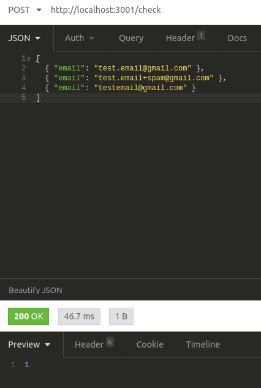
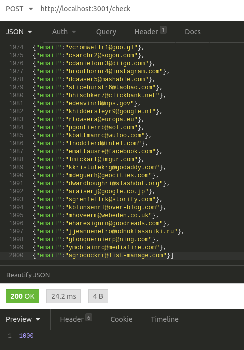

# Email checker using  HTTP requests

**Problem statement**: Accept a list of email addresses as a HTTP request and response is an integer indicating the number of unique email addresses. Where "unique" email addresses means they will be delivered to the same account using Gmail account matching. Specifically: Gmail will ignore the placement of **"."** in the username. And it will ignore any portion of the username after a **"+"**.

*Examples*:

test.email@gmail.com, test.email+spam@gmail.com and testemail@gmail.com will all go to the same address, and thus the result should be 1.

## Installation

> npm install

## Start expressjs server 

> npm start

## Request data

Send a request with a JSON body to /check

JSON format:
> [ { "email" : "example@email.com" } ]

## Testing

To use the test data check the folder test for test data and send the request with Insomnia, Postman, cUrl, etc..

---
Example screenshots taken in Insomnia

 

 

